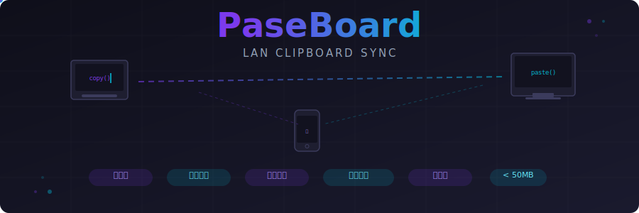

<p align="center">
  
</p>

<h3 align="center">局域网剪贴板同步 · 复制即传输</h3>

<p align="center">
  
  
  
  
</p>

---

在多台设备之间复制粘贴，应该像在同一台机器上一样简单。

PaseBoard 是一个局域网剪贴板同步工具。装上启动就行，不用注册、不用配置服务器、不用登录。同一 WiFi 下的设备自动发现彼此，复制的内容一秒钟内出现在其他设备的剪贴板里。文本、图片都支持。

## 功能

- **开箱即用** — 启动后自动发现局域网设备，不需要任何配置
- **文本 + 图片** — 复制的文字和截图都能同步，历史记录里可以直接预览图片
- **加密传输** — 设备间通信全程 AES-256-GCM 加密，密钥通过 ECDH 协商
- **配对授权** — 新设备连接时需要手动确认，防止陌生设备偷看你的剪贴板
- **历史记录** — 最近 1000 条记录随时回查，点击即可复制回剪贴板
- **轻量** — 后台常驻内存不到 50MB，基本不占 CPU

## 安装

去 [Releases](https://github.com/EvilJul/paseboard/releases) 页面下载对应平台的包。

**macOS** — `.dmg` 拖进 Applications，首次打开可能会弹安全提示，去「系统设置 → 隐私与安全性」允许一下就好。

**Windows** — `.msi` 双击装。

**Linux** — 提供 `.deb`、`.rpm`、`.AppImage` 三种格式。mDNS 需要 Avahi：

```bash
# Ubuntu / Debian
sudo apt install avahi-daemon

# Fedora
sudo dnf install avahi
```

## 使用

装好打开，托盘里会出现图标。在同一局域网的其他设备上也装好打开，它们会自动连上。

- 正常复制粘贴就行，内容会自动同步
- 双击托盘图标打开主窗口，查看设备列表和历史记录
- 新设备首次连接会弹出配对确认，点同意就行
- 右键托盘图标可以退出

## 开发

```bash
git clone https://github.com/EvilJul/paseboard.git
cd paseboard/src-tauri

# 开发模式
cargo tauri dev

# 构建
cargo tauri build

# 测试
cargo test
```

### 项目结构

```
paseboard/
├── ui/                    # 前端（原生 HTML/CSS/JS）
│   └── index.html
├── src-tauri/
│   ├── src/
│   │   ├── main.rs        # Tauri 入口 + IPC 命令
│   │   ├── app.rs         # 应用主逻辑协调
│   │   ├── clipboard/     # 剪贴板监听、写入、存储
│   │   ├── network/       # mDNS 发现、WebSocket 通信、加密
│   │   └── utils/         # 错误类型定义
│   └── Cargo.toml
└── assets/                # 文档资源
```

### 技术栈

| 层 | 选型 |
|---|------|
| 桌面框架 | Tauri v2 |
| 后端语言 | Rust + Tokio |
| 设备发现 | mDNS + UDP 广播 |
| 实时通信 | WebSocket (tokio-tungstenite) |
| 数据存储 | SQLite (rusqlite + SQLCipher) |
| 剪贴板 | arboard |
| 加密 | X25519 ECDH + AES-256-GCM |

## 安全说明

- 设备间通信使用 ECDH 密钥交换 + AES-256-GCM 加密
- 配对需要手动确认，未配对设备无法获取剪贴板内容
- 所有数据仅在局域网内传输，不经过任何云端服务器
- 剪贴板历史存储在本地加密数据库中

## 已知限制

- 同一局域网内建议不超过 10 台设备同时连接
- 单条内容上限 10MB
- 图片以 PNG 格式传输，大图可能有几秒延迟

## License

[MIT](LICENSE)
